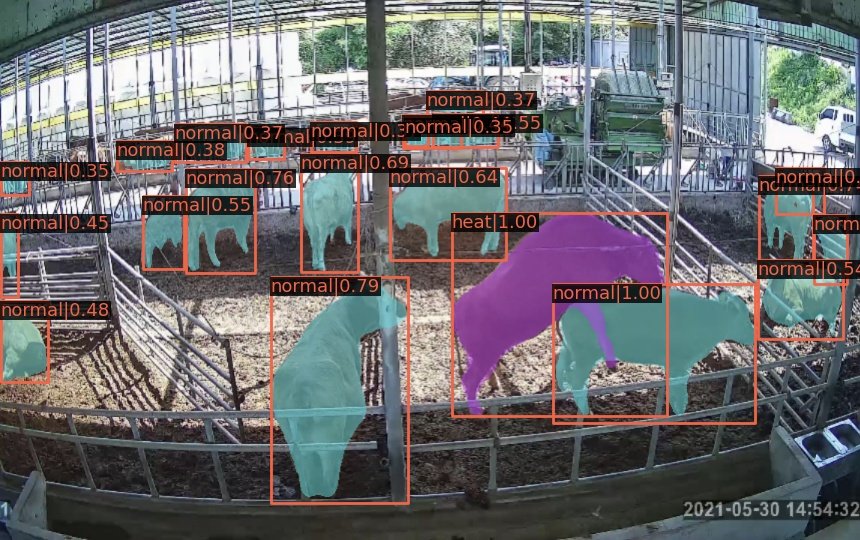
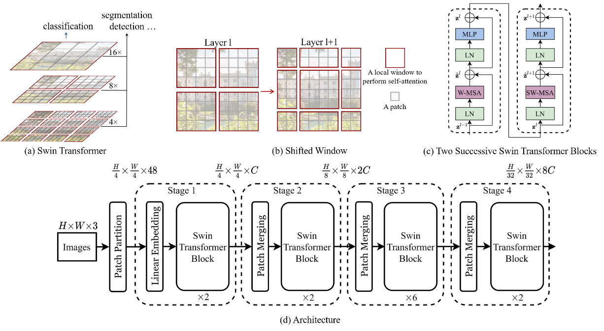

# 🐄 스마트축사 데이터 활용대회 — 발정 소 탐지

> **우수상 (2위)** | 과학기술정보통신부 · NIA · SK주식회사 · 2022.01

[](https://www.nia.or.kr)
[](.)
[](.)
[](https://github.com/open-mmlab/mmdetection)

---

## 대회 개요

축사 CCTV 영상에서 **발정 상태인 소를 자동 판별**하여 적기 번식 관리로 생산성을 높이는 AI 모델 개발.

| 항목 | 내용 |
|------|------|
| 주최 | 과학기술정보통신부 · NIA · SK주식회사 |
| 기간 | 2022.01 |
| 과제 | Instance Segmentation — 소 발정 여부 분류 (`normal` / `heat`) |
| 평가 지표 | Weighted mAP |
| 최종 순위 | **2위 (우수상)** |
| 최종 점수 | **Weighted mAP 0.97434** |

---

## 추론 결과 예시



> 초록 마스크(`normal`) / 보라 마스크(`heat`) 로 발정 소를 인스턴스 단위로 구분.  
> confidence score와 함께 bounding box + segmentation mask 동시 출력.

---

## 문제 정의

축사 CCTV 영상에서 소의 발정 상태를 사람이 육안으로 모니터링하는 방식은 비효율적이고 누락이 잦습니다.  
이를 AI 기반 인스턴스 세그멘테이션으로 자동화하여 농가의 번식 관리 효율을 높이는 것이 목표입니다.

- **Class 1 (`normal`)**: 일반 상태의 소
- **Class 2 (`heat`)**: 발정 상태의 소

---

## 접근 방법

### 1. 데이터 전처리

대회 제공 어노테이션을 **COCO 포맷**으로 변환:
- Segmentation polygon → bbox (`xmin, ymin, width, height`) 자동 계산
- Category ID 매핑 (`normal`: 1, `heat`: 2)
- Mask area 계산 후 annotation에 반영

```
CODE/
├── data/
│   └── sk/
│       ├── train_images/
│       ├── test_images/
│       └── annotations/
├── preparing_datasets.ipynb   # 데이터 전처리
└── to_submission.ipynb        # 예측 결과 → 제출 포맷 변환
```

### 2. 이미지 전처리 실험

성능 개선을 기대하며 다양한 전처리 조합을 실험했으나, **유의미한 성능 향상은 없었습니다.**

| 전처리 방법 | 결과 |
|------------|------|
| 흑백(Grayscale) 변환 | 성능 향상 없음 |
| 채도(Saturation) 채널 분리 | 성능 향상 없음 |
| 원본 RGB | **최종 채택** |

> 축사 CCTV 특성상 조명·환경이 일정하여 색상 전처리의 효과가 제한적이었습니다.  
> 이후 전처리보다 **모델 선택**에 집중하는 전략으로 전환했습니다.

### 3. 모델 선정

`papers-with-code` 기준 object detection / instance segmentation SOTA를 조사하여  
**Swin Transformer Object Detection** 채택.

| 모델 | Weighted mAP | 비고 |
|------|-------------|------|
| YOLOv5 | - | 초기 실험 |
| Mask R-CNN | - | 비교 실험 |
| **Swin Transformer** | **0.97434** | **최종 채택** |

- Paper: [Swin Transformer: Hierarchical Vision Transformer using Shifted Windows](https://arxiv.org/pdf/2103.14030.pdf)
- Code Base: [SwinTransformer/Swin-Transformer-Object-Detection](https://github.com/SwinTransformer/Swin-Transformer-Object-Detection)
- Framework: [mmdetection](https://github.com/open-mmlab/mmdetection)

---

## Swin Transformer



Swin Transformer는 Vision Transformer(ViT)의 한계였던 **고해상도 이미지 처리 비용 문제**를 해결한 계층형 비전 트랜스포머입니다.

### 핵심 아이디어: Shifted Window Self-Attention

기존 ViT는 전체 이미지를 하나의 시퀀스로 처리해 연산량이 이미지 크기의 제곱에 비례했습니다.  
Swin Transformer는 **로컬 윈도우(Local Window)** 내에서만 self-attention을 수행하고,  
레이어마다 윈도우를 이동(Shift)시켜 인접 윈도우 간 정보 교환을 가능하게 합니다.

| 구분 | ViT | Swin Transformer |
|------|-----|-----------------|
| Attention 범위 | 전체 이미지 | 로컬 윈도우 |
| 연산 복잡도 | O(n²) | O(n) |
| 다중 스케일 피처 | ✗ | ✅ (FPN 대체 가능) |
| 객체 탐지 적합성 | 낮음 | **높음** |

### 계층형 구조 (Hierarchical Feature Maps)

4개의 Stage를 거치며 feature map 해상도를 점진적으로 줄이고 채널을 늘립니다:

```
입력 (H×W×3)
  → Stage 1: H/4  × W/4  × 48C   (Swin Block ×2)
  → Stage 2: H/8  × W/8  × 96C   (Swin Block ×2)
  → Stage 3: H/16 × W/16 × 192C  (Swin Block ×6)
  → Stage 4: H/32 × W/32 × 384C  (Swin Block ×2)
```

이 다중 스케일 피처맵이 객체 탐지·세그멘테이션에 특히 강점을 가집니다.

---

## 환경

```
OS      : Ubuntu 18.04
GPU     : RTX 3090
CUDA    : 11.0
PyTorch : 1.7.0+cu110
mmcv    : 1.4.0
```

### 설치

```bash
python -m venv venv && source venv/bin/activate

pip install torch==1.7.0+cu110 torchvision==0.8.1+cu110 torchaudio==0.7.0 \
    -f https://download.pytorch.org/whl/torch_stable.html

pip install mmcv-full==1.4.0 \
    -f https://download.openmmlab.com/mmcv/dist/cu110/torch1.7.0/index.html

cd [코드디렉토리] && pip install -v -e .
cd [코드디렉토리]/apex && pip install -v --disable-pip-version-check --no-cache-dir ./
```

---

## 추론 및 학습

```bash
# 추론 (제공 weights 사용)
CUDA_VISIBLE_DEVICES=0 python tools/test.py \
    configs/swin/skcomB.py weights.pth \
    --show-dir outputs/images \
    --format-only \
    --eval-options "jsonfile_prefix=outputs/test"

# 학습 후 추론
CUDA_VISIBLE_DEVICES=0 python tools/train.py configs/swin/skcomB.py --no-validate
CUDA_VISIBLE_DEVICES=0 python tools/test.py \
    configs/swin/skcomB.py work_dirs/skcomB/latest.pth \
    --show-dir outputs/images \
    --format-only \
    --eval-options "jsonfile_prefix=outputs/test"
```

---

## 결과

| 지표 | 점수 |
|------|------|
| Weighted mAP | **0.97434** |
| 최종 순위 | **2위 (우수상)** |

이 연구는 **KSC 2023 학술발표**로 이어졌습니다.

---

## 비고

- 코드는 대회 규정 및 데이터 보안상 비공개입니다.
